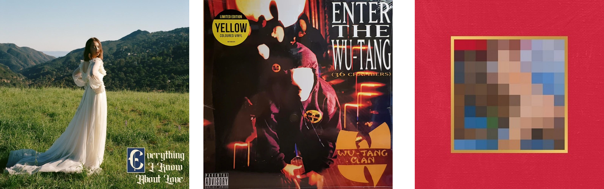

 

   

## FAQs
1. How do I download the pcap?
> Click on the title at the top of each page.  

2. I am stuck and don't know what to do. I am lost and have no idea how to answer a question.
> Please let me know.

3. I don't have a Virtual Machine. What's the easiest/laziest way to get one quick?
> Google how to do it.  
>  
> If you don't have one that's okay but if you quit learning before even getting a VM then bismallah you're cooked.

4. I think there are mistakes and that a quiz's answer is wrong.
> Please let me know.

5. I think a quiz is broken or a question is not accepting any answer.
> Please let me know.

 

## Additional Resources 

[Learn Regex](https://regexlearn.com/learn/regex101)  
[TryHackMe Study Path for Linux Beginners](https://tryhackme.com/resources/blog/where-to-learn-kali-linux-with-practical-labs-beginner-friendly)  
[Kali Linux LinuxZoo Labs](https://linuxzoo.net/page/kali2024-4/wk01.html)  