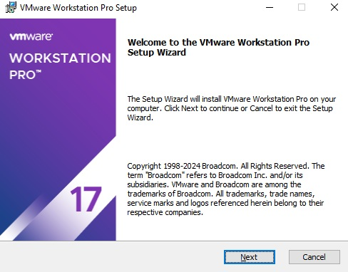
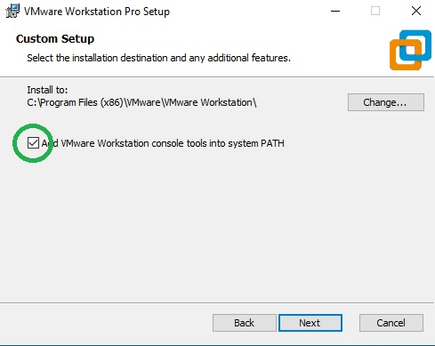
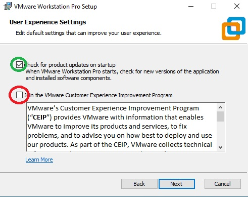
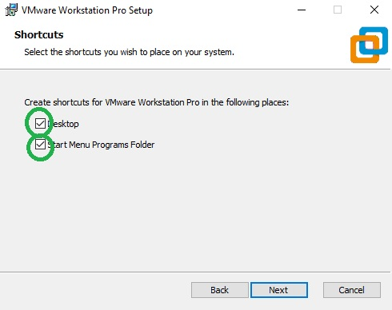
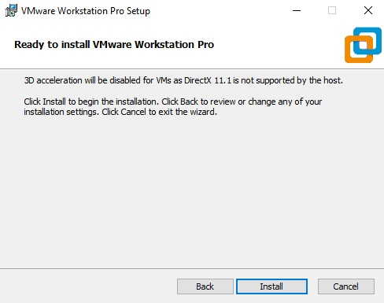
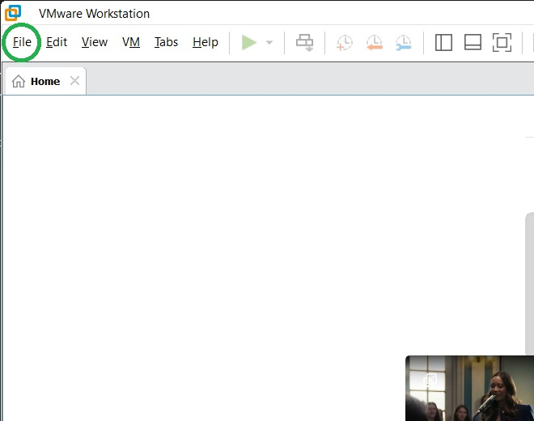
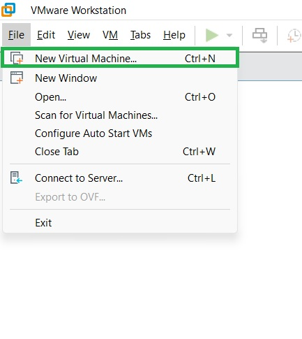
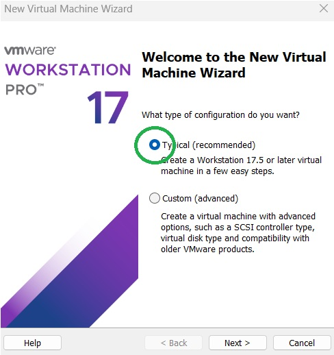

# Lesson 1

The first step in to becoming a **CYBER WARRIOR** is to install a virtual machine in your personal laptop.

Install VMWare into your machine by getting the .exe installer and following the prompts:
<a href="https://www.kali.org/get-kali/#kali-virtual-machines" target="_blank">https://archive.org/download/vmware-workstation-17.0.0/VMware-workstation-full-17.0.0-20800274.exe</a>

  
> [!WARNING]  
> Hold your horses! VMWare is just a hypervisor not a virtual machine!

A virtual machine is just a mini operating system running within your main operating system. Computer engineers discovered that operating systems can be designed to specialise for a certain purpose. So that's why for this purpose, use the Kali Linux operating system to practice your pcap literacy.
  
<a href="https://www.kali.org/get-kali/#kali-virtual-machines" target="_blank">https://www.kali.org/get-kali/#kali-virtual-machines</a>
  
Click the <u>🠇</u> button for VMWare 
  

  
> [!IMPORTANT]  
> Your VM will come as a zip file. Make sure to extract after downloading!

