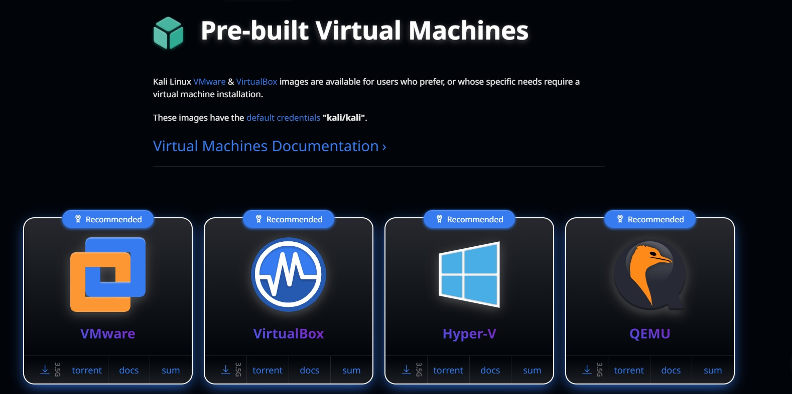

<h1 id="h-note">Lesson 1</h1>

The first step in to becoming a **CYBER WARRIOR™** is to install a virtual machine in your personal laptop.

*Skip this lesson if you already have a Kali VM ready to go*  

Install VMWare into your machine by getting the .exe installer and following the prompts:
  
<a href="https://web.archive.org/web/20240922215816/https://downloads2.broadcom.com/?file=VMware-workstation-full-17.6.0-24238078.exe&oid=32039362&id=7LlA4HsxBGBipRAxOsR_7WPvXc9mhXCCp5Lf2ufvONu7TBP0sqrrpSUu2FcjRRalrxOcHgM1NjZvo3s=&verify=1727042125-f15SprN9bOyDWgW2AlbuRuiPhHzehg2aj4Pu6wl%2FVbA%3D" target="_blank">https://web.archive.org/web/20240922215816/https://downloads2.broadcom.com/?file=VMware-workstation-full-17.6.0-24238078.exe&oid=32039362&id=7LlA4HsxBGBipRAxOsR_7WPvXc9mhXCCp5Lf2ufvONu7TBP0sqrrpSUu2FcjRRalrxOcHgM1NjZvo3s=&verify=1727042125-f15SprN9bOyDWgW2AlbuRuiPhHzehg2aj4Pu6wl%2FVbA%3D</a>

  
> [!WARNING]  
> Hold your horses! VMWare is just a hypervisor not a virtual machine!

A virtual machine is just a mini operating system running within your main operating system. That's why for learning pcaps, use the Kali Linux operating system. Kali Linux will be running inside your main OS so you can avoid shitting where you eat.
  
The following link will direct you to download a Virtual Machine image:  
<a href="https://www.kali.org/get-kali/#kali-virtual-machines" target="_blank">https://www.kali.org/get-kali/#kali-virtual-machines</a>
  
Click the <u>🠇</u> button for VMWare 

> [!IMPORTANT]  
> Your VM will come as a zip file. Make sure to extract after downloading!

Next step is to combine VMware and Kali Linux. VMware is the software to run virtual machines, the Kali files you downloaded is the virtual machine itself.

> [!NOTE]  
> Username: kali  
> Password: kali  

Congrats cuh! You have a virtual machine. Click the right arrow or press the `->` key to go to the next page.