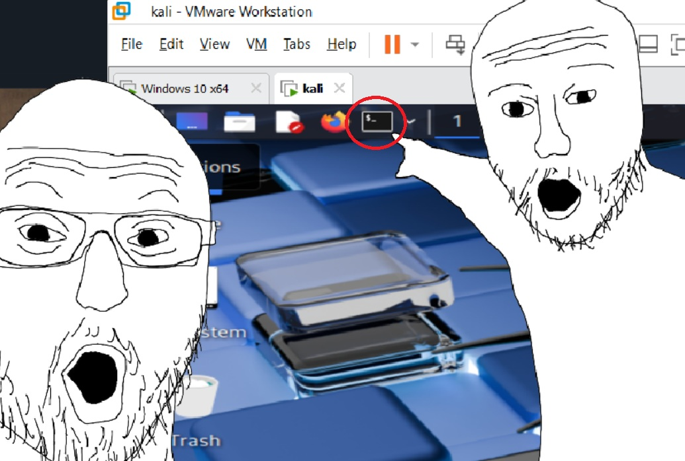
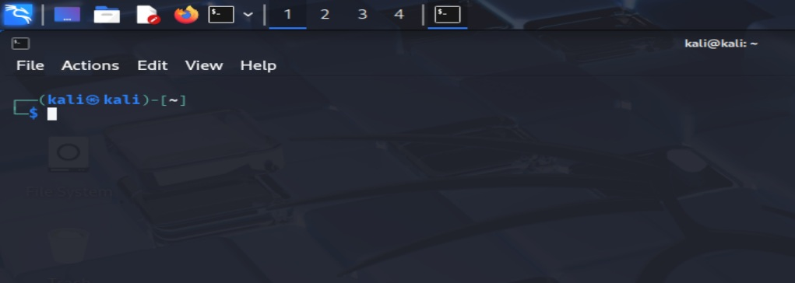

<h1 id="h-tip">Lesson 2</h1>

If you have 0 pcap literacy, you need to start by being comfortable with a console.
  


A console is where you can tell the computer to do things.
  
Enter these commands into the console and see what happens:


`ls`
  
`touch file1`
  
`l`

`echo hello`

`tshark -h`

`cd Downloads`

> [!TIP]  
> Ctrl + Shift + V to paste commands in a Kali console.

Okay! You should now be a **MASTER** at Linux command line.
  
Time to learn Linux file systems.

This is your file system tree.
```
/ <- root directory
    /bin
    /dev
    /home
        /home/kali
            /home/kali/Downloads
            /home/kali/Documents <- you should be here
            /home/kali/Music
            /home/kali/Pictures
            /home/kali/Videos
    /mnt
    /run
    /sys
    /usr
    /boot
    /etc
    /opt
    /root
    /tmp
    /var
```

The `cd` commmand lets you move directories. If you do `cd ..` you will move upwards in the tree.

```
/
    /bin
    /dev
    /home
        /home/kali <- You are now here
    /run
```

Do this command `cd usr/share/bin` to move to a specific place in the tree.

```
/
    /run
    /sys
    /usr
        /usr/share
            /usr/share/nikto
            /usr/share/nmap <- You are now here
            /usr/share/nodejs
    /boot
    /etc
```

Do `cd ../../../` to move upwards 3 times in the tree

```
/ <- You are now here
    /run
    /sys
    /usr
    /boot
    /etc
```

You should now be an **EXPERT** in linux file systems!

<h1 id="h-tip">QUIZ!</h1>
  
<div class="container">
    <div class="form-row">
        <div class="container">
            <ol>
                <li>
                    <p><code>cd ~</code><br>
                    <code>pwd</code><br>
                    What is your current directory? </p>
                    <ul class="textbox">
                        <li><input type="text" data-content="/ilak/emoh/" data-question="/sislsasks/sesmsoshs/s" placeholder="/****/****/" class="form-control" />
                    </ul>
                </li>
                <li>
                    <p><code>cd /home/kali</code><br>
                    <code>cd Downloads</code><br>
                    <code>pwd</code><br>
                    What is your current directory? </p>
                    <ul class="textbox">
                        <li><input type="text" data-content="sdaolnwoD/ilak/emoh/" data-question="ssdsasoslsnswsosDs/sislsasks/sesmsoshs/s" placeholder="/****/****/*********." class="form-control" />
                    </ul>
                </li>
            </ol>
        </div>
    </div>
</div>
  
> [!TIP]  
> Ctrl + Shift + C to copy text in a Kali console.
  
<div class="container">
    <div class="form-row">
        <div class="container">
            <ol start="3">
                <li>
                    <p><code>cd /etc/ssh/ssh_config.d</code><br>
                    <code>pwd</code><br>
                    What is your current directory? </p>
                    <ul class="textbox">
                        <li><input type="text" data-content="d.gifnoc_hss/hss/cte/" data-question="ds.sgsisfsnsoscs_shsssss/shsssss/scstses/s" placeholder="/?/?/?" class="form-control" />
                    </ul>
                </li>
                <li>
                    <p><code>cd /etc/dconf/db/local.d</code><br>
                    <code>cd ../../../../sys/devices</code><br>
                    <code>pwd</code><br>
                    What is your current directory? </p>
                    <ul class="textbox">
                        <li><input type="text" data-content="secived/sys/" data-question="ssescsisvsesds/sssysss/s" placeholder="/?/?" class="form-control" />
                    </ul>
                </li>
                <li>
                    <p><code>cd</code><br>
                    <code>cd ../../usr/share/doc</code><br>
                    <code>pwd</code><br>
                    What is your current directory?</p>
                    <ul class="textbox">
                        <li><input type="text" data-content="cod/erahs/rsu/" data-question="csosds/sesrsashsss/srsssus/s" placeholder="/?????" class="form-control" />
                    </ul>
                </li>
                <li>
                    <p><code>cd</code><br>
                    <code>cd ../______</code><br>
                    <code>pwd</code><br>
                    Fill in the blank where <code>pwd</code> prints <code>/usr/local/lib</code></p>
                    <ul class="textbox">
                        <li><input type="text" data-content="bil/lacol/rsu/.." data-question="bsisls/slsascsosls/srsssus/s.s.s" placeholder="/??????" class="form-control" />
                    </ul>
                </li>
                <li>
                    <p><code>cd /usr/share/doc</code><br>
                    <code>cd _________var/lib</code><br>
                    <code>cd nfs</code><br>
                    <code>pwd</code><br>
                    Use <code>../</code> to fill in the blank where <code>pwd</code> prints <code>/var/lib/nfs</code></p>
                    <ul class="textbox">
                        <li><input type="text" data-content="/../../.." data-question="/s.s.s/s.s.s/s.s.s" placeholder="/?????" class="form-control" />
                    </ul>
                </li>
            </ol>
        </div>
    </div>
</div>
  
> [!TIP]  
> Hit the `TAB` during an incomplete command for a possible auto-complete!
  
<div class="container">
    <div class="form-row">
        <div class="container">
            <ol start="8">
                <li>
                    <p><code>cd /usr/share/_______</code><br>
                    <code>pwd</code><br>
                    Fill in the blank where <code>pwd</code> prints <code>/usr/share/perl5/encode</code></p>
                    <ul class="textbox">
                        <li><input type="text" data-content="edocne/5lrep" data-question="esdsoscsnses/s5slsrsesps" placeholder="/?????" class="form-control" />
                    </ul>
                </li>
                <li>
                    <p><code>cd</code><br>
                    <code>cd ___usr/local/lib</code><br>
                    <code>pwd</code><br>
                    Fill in the blank where <code>pwd</code> prints <code>usr/local/lib</code></p>
                    <ul class="textbox">
                        <li><input type="text" data-content="/" data-question="/s" placeholder="*" class="form-control" />
                    </ul>
                </li>
                <li>
                    <p><code>cd</code><br>
                    <code>cd ../_____bin/_____dev/net/______usr/local/lib</code><br>
                    <code>pwd</code><br>
                    Fix the missing blanks and retype the full path where <code>pwd</code> prints <code>usr/local/lib</code></p>
                    <ul class="textbox">
                        <li><input type="text" data-content="bil/lacol/rsu/../../ten/ved/../nib/../.." data-question="bsisls/slsascsosls/srsssus/s.s.s/s.s.s/stsesns/svsesds/s.s.s/snsisbs/s.s.s/s.s.s" placeholder="../?????/bin/?????/dev/net/?????usr/local/lib" class="form-control" />
                    </ul>
                </li>
            </ol>
        </div>
    </div>
    <div id="tg-msg" class="alert" role="alert" style="display: none">
        <span id="tg-correct-questions"></span> Correct! <br /><b>Rating: <span id="tg-score"></span>%</b>
    </div>
    <div class="row">
        <button id="check-questions" class="btn btn-lg btn-success">Check</button>
        <button id="reset-questions" class="btn btn-link">Reset All</button>
    </div>
</div>
<script type="text/javascript">//console.log("Check");
    $(function(){
    $('ul.radio-list,ul.checklist,ul.textbox').each(function(i, el){
        var questionClass = $(this).attr('class');
        $(this).parent().addClass('question-row').addClass(questionClass);
        if (questionClass=='radio-list') {
            $(this).find('input[type="radio"]').attr('name', 'radio-question-' + i);
        }
    });
        function checkQuestion() {
            resetQuestions(true);
            var questions = $('li.question-row');
            var total_questions = questions.length;
            var correct = 0;
            questions.each(function(i, el) {
                var self = $(this);
                // Single Question.
                if (self.hasClass('radio-list')) {
                    //if correct, save data-question as localStorage key
                    //Will use key-value to reenter answers at startup
                    if (self.find('input[type="radio"][data-content="1"]:checked').length == 1) {
                        var checkbox = self.find('input[type="radio"]');
                        var question = String(checkbox.data("question"));
                        localStorage.setItem(question, true);
                        correct += 1;
                    } else {
                        self.addClass('text-danger');
                    }
                }
                // Textbox Question.
                if(self.hasClass('textbox')) {
                    var textbox = self.find('input[type="text"]');
                    var current_text = String(textbox.val()).trim().toLowerCase();
                    var correct_text = String(textbox.data("content")).trim().split("").reverse().join("");
                    var question = String(textbox.data("question"));
                    if(current_text==correct_text.toLowerCase()) {
                        correct += 1;
                        localStorage.setItem(question, textbox.data("content"));
                    } else {
                        self.addClass('text-danger');
                        textbox.parent().find("i.text-correct").html(correct_text);
                    }
                }
                // Multiple selection Questions.
                if(self.hasClass('checklist')) {
                    var total_corrects = self.find('input[type="checkbox"][data-content="1"]').length;
                    var total_incorrects = self.find('input[type="checkbox"][data-content="0"]').length;
                    var correct_selected = self.find('input[type="checkbox"][data-content="1"]:checked').length;
                    var incorrect_selected = self.find('input[type="checkbox"][data-content="0"]:checked').length;
                    var qc = +((correct_selected / total_corrects) - (incorrect_selected/total_incorrects)).toFixed(2);
                    if (qc < 0) {
                        qc = 0;
                    } else if (qc == 1) {
                        var checkbox = self.find('input[type="checkbox"]');
                        var question = String(checkbox.data("question"));
                        localStorage.setItem(question, true);
                    }
                    correct += qc;
                    if (qc == 0) {
                        self.addClass('text-danger');
                    } else if (qc > 0 && qc < 1) {
                        self.addClass('text-warning');
                    }
                }
            });
            showScore(correct, total_questions);
        }
        function showScore(correct, total) {
            var score = (correct / total).toFixed(2) * 100;
            var msgClass = 'alert-danger';
            if (score >= 70) {
                msgClass = 'alert-success';
            } else if (score >= 50) {
                msgClass = 'alert-warning';
            }
            $('#tg-correct-questions').text(correct + ' out of ' + total);
            $('#tg-score').text(score);
            $('#tg-msg').addClass(msgClass).show();
        }
        function resetQuestions(keep) {
            $('li.question-row').removeClass('text-danger').removeClass('text-warning');
            $('i.text-correct').html('');
            $('#tg-msg').removeClass('alert-danger').removeClass('alert-success').removeClass('alert-warning').hide();
            if(keep === true) {
                return;
            }
            $('li.question-row').find('input[type="text"]').val('');
            $('li.question-row').find('input[type="radio"],input[type="checkbox"]').prop('checked', false);
        }
        $('#check-questions').on('click', checkQuestion);
        $('#reset-questions').on('click', resetQuestions);
    });
    //On document ready, reenter saved answers and click the "Check" button
    $(document).ready(function () {
        var previously_answered = false;
        //for loop for localStorage values
        $.each(Object.keys(localStorage), function(i, key) {
            const value = localStorage.getItem(key);
            var questions = $('li.question-row');
            questions.each(function(i, el) {
                var self = $(this);
                if (self.find('[data-question]').data("question") == key) {
                        //answers are recreated
                        if (self.hasClass('radio-list')) {
                        self.find('input[type="radio"][data-content="1"]')[0].checked = true;
                        } else if (self.hasClass('textbox')) {
                        self.find('input[type="text"]')[0].value = value.trim().split("").reverse().join("");
                        } else if (self.hasClass('checklist')) {
                        var checkboxes = self.find('input[type="checkbox"][data-content="1"]');
                        for(var y = 0; y < checkboxes.length; y++){
                            checkboxes[y].checked = true;
                        }
                    }
                    //value saved for any key match, value is used to check if the button needs to be pressed
                    previously_answered = true;
                };
            });
        });
        if (previously_answered) {
                document.getElementById("check-questions").click();
        }
    });
</script>
  
> [!TIP]  
> Ctrl + Shift + C to copy text in a Kali console.