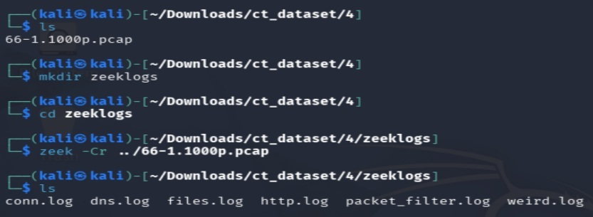
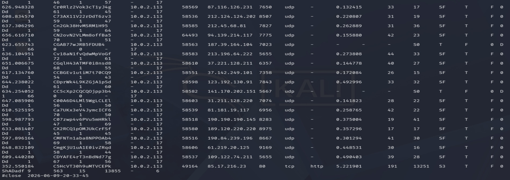
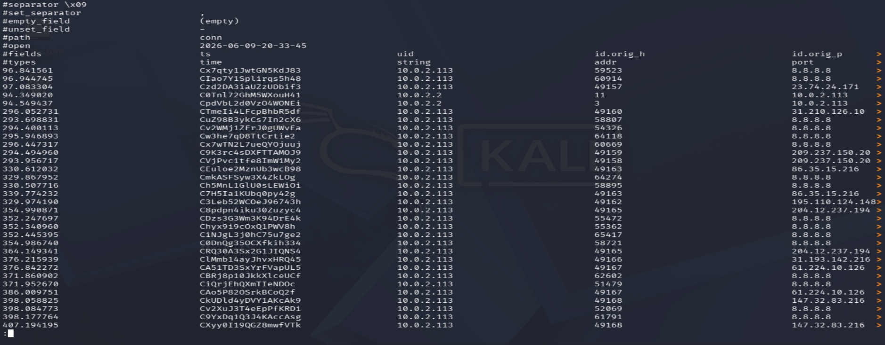
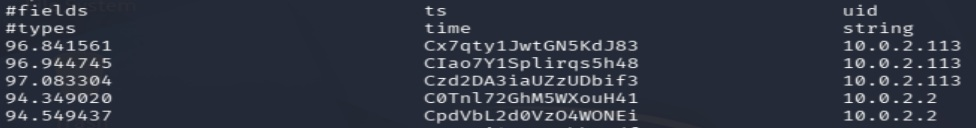
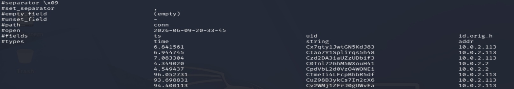
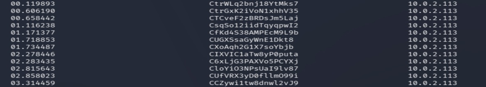

<h1 id="h-important">Lesson 4</h1>

Zeek is a network analysis tool that reads network traffic from a pcap and organises the data into different log files based on type or protocol.

*Skip this lesson if your Kali VM has Zeek already installed.* 
  
So if you have a pcap with several things going on, let's say http connections and a file transfer (FTP), then putting zeek through that pcap will make a file named `http.log` and `ftp.log`.
  
The greatest strength of zeek is organising your data to make it easier for the human (and the computer) to read big data. If you have 1000 http connections, 1000 SSH, 1000 FTP, 1000 emails, and all of that in a single pcap then that clutter would be extremely hard to read and furthermore would be extremely hard to work with (Wireshark will start slowing down starting at 2GB+ pcaps).
  
However, as a reminder, you can never be a master at something on the first day. Don't be intimitated if you think reading zeek logs is complicated (because it is) but with continuous practice and persistent study habits zeek logs will be understand to see after each exercise.
  
The following is a link for a zeek cheat sheet: *so many fields!*  
<a href="https://www.corelight.com/hubfs/cheat-sheet/bro-zeek-msft-logs-combo.pdf?hsLang=en">https://www.corelight.com/hubfs/cheat-sheet/bro-zeek-msft-logs-combo.pdf?hsLang=en</a>

Kali Linux does not come shipped with Zeek installed. That's why you'll have to use the Linux console to install Zeek manually.

Copy and paste this multi-line command to your console *Ctrl + Shift + V*
```echo 'deb https://download.opensuse.org/repositories/security:/zeek/xUbuntu_24.04/ /' | sudo tee /etc/apt/sources.list.d/security:zeek.list
curl -fsSL https://download.opensuse.org/repositories/security:zeek/xUbuntu_24.04/Release.key | gpg --dearmor | sudo tee /etc/apt/trusted.gpg.d/security_zeek.gpg > /dev/null
sudo apt update
sudo apt install zeek-8.0
```
  
Thee will be prompts during downloading. Say yes to all.
  
Afterwards, you will need to do a final command:
`export PATH=/opt/zeek/bin:$PATH`  
This will tell Kali Linux which folder Zeek is located in.
  
> [!WARNING]
> The `export` command is not saved and will not persist after closing the console or restarting.  
> Run these commands for persistance!:  
> `echo "export PATH=/opt/zeek/bin:$PATH" >> ~/.bashrc`  
> `echo "export PATH=/opt/zeek/bin:$PATH" >> ~/.zshrc`  

Now try if zeek works!
`zeek -h`
  
Now use Zeek on a pcap! <a href="https://mcfp.felk.cvut.cz/publicDatasets/CTU-Malware-Capture-Botnet-66-1/66-1.1000p.pcap">Download me</a>


> [!TIP]
> It's good practice to do your zeeklogs in a seperate folder.
  
Now try reading one these logs, (conn.log is short for connections)  
`cat conn.log`  
  

*Eww!*

> [!NOTE]
> id.orig_h is Source IP  
> id.orig_p is Source Port  
> id.resp_h is Destination IP  
> id.resp_p is Destination Port  

Spruce it up with `less`  
`cat conn.log | less -Sx25`  
left, down, up, right arrows are enabled in less. Press `q` to leave


*Wow! Sugoi!*

Hold up! The fields don't align... 

The first timestamp shouldn't equal Cx7qty1, it should equal 96.841561.

Use `awk` to realign your text fields!  
`cat conn.log | awk 'gsub(/^[0-9]/, "\t")1' | less -Sx25`  


*Aligned!*

Timestamps look a little bit weird now? They're not sorted.
  
Use `sort`!  
`cat conn.log | awk 'gsub(/^[0-9]/, "\t")1' | sort -nk 2 | less -Sx40`  
`-nk 2` to sort the data from lowest to highest number on the 2nd field (time)


*Sorted!*

Forget making Zeek look pretty. You need to get specific information from the dump that zeek logs give you.

Use `zeek-cut` and Zeek fields such as `id.orig_h` (Source IP), `service`, `local_orig` (internal/external)

`cat conn.log | zeek-cut id.orig_h` *No more screenshots, try it out yourself.*

```
10.0.2.113
10.0.2.113
10.0.2.113
10.0.2.113
10.0.2.113
10.0.2.113
10.0.2.113
10.0.2.113
10.0.2.113
```

But wait. The output doesn't make any sense.

Use `sort` again and filter them out with `uniq`  
`cat conn.log | zeek-cut id.orig_h | sort | uniq`  

```
10.0.2.113
10.0.2.2
123.240.186.166
141.170.195.154
202.125.67.136
203.77.73.217
210.56.19.1
```
This lists the unique source IPs found in the pcap.  
  
Try to get more information!  
`cat conn.log | zeek-cut id.orig_h | sort | uniq -c | sort -n`  

```
1 123.240.186.166
1 141.170.195.154
1 202.125.67.136
1 203.77.73.217
1 210.56.19.1
2 10.0.2.2
475 10.0.2.113
```
This counts how many times each source IP appears in the pcap.  

Do more and add another `zeek-cut` field.  
`cat conn.log | zeek-cut id.orig_h id.resp_h | sort | uniq -c | sort -n`  
```
2 10.0.2.113      213.240.247.171
2 10.0.2.113      54.225.227.186
2 10.0.2.113      61.224.10.126
2 10.0.2.113      86.35.15.216
2 10.0.2.113      89.165.165.39
2 10.0.2.2        10.0.2.113
26 10.0.2.113      8.8.8.8
```
This counts how many times each unique IP connection (Source -> Destination) happened in the pcap.  
  
What about if you only want the top IP and don't care if it's a destination or source IP?  
If you do `zeek-cut id.orig_h id.resp_h` they're stuck together and `uniq` can't count properly.  
```
10.0.2.113      213.240.247.1
10.0.2.113      54.225.227.18
10.0.2.113      61.224.10.126
10.0.2.113      86.35.15.216
```

In this case use `tr`! It replaces a given character with another one.  
`cat conn.log | zeek-cut id.orig_h id.resp_h | tr -s '\t' '\n' | sort | uniq -c | sort -n`  
```
2 213.240.247.171
2 54.225.227.186
2 61.224.10.126
2 86.35.15.216
2 89.165.165.39
26 8.8.8.8
482 10.0.2.113
```

You should now be a **GRANDMASTER** in Zeek!