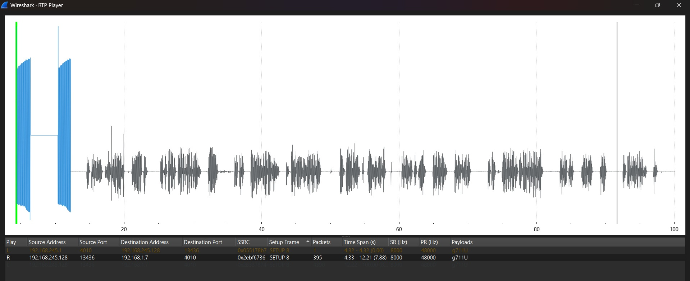

<h1 id="h-warning"><a href="https://github.com/Laufeynumber1fan/pcapliteracy/raw/refs/heads/gh-pages/pcaps/1-10/trouble.pcapng">Trouble <u>🠇</u></h1></a>
> [!WARNING]  
> This pcap intercepted a phone call!

    

        

        

        <ol>
            <li>
                
Which protocol has the most packets in the pcap?

                <ul class="radio-list">
                    <li><label><input type="radio" data-question="PIoV" data-content="0" /> VoIP</label></li>
                    <li><label><input type="radio" data-question="PCT" data-content="0" /> TCP</label></li>
                    <li><label><input type="radio" data-question="PTR" data-content="1" /> RTP</label></li>
                    <li><label><input type="radio" data-question="PTTH" data-content="0" /> HTTP</label></li>
                    <li><label><input type="radio" data-question="PIS" data-content="0" /> SIP</label></li>
                </ul>
            </li>
            <li>
                
What's the Caller ID of the person calling James?

                <ul class="radio-list">
                    <li><label><input type="radio" data-question="knaB" data-content="1" /> Bank</label></li>
                    <li><label><input type="radio" data-question="moM" data-content="0" /> Mom</label></li>
                    <li><label><input type="radio" data-question="nwonknU" data-content="0" /> Unknown</label></li>
                    <li><label><input type="radio" data-question="kroW" data-content="0" /> Work</label></li>
                </ul>
            </li>
            <li>
                
Listen to the voice call, what kind of attack is James a victim of?

                <ul class="radio-list">
                    <li><label><input type="radio" data-question="kcattA" data-content="0" /> Man In The Middle Attack</label></li>
                    <li><label><input type="radio" data-question="kcattA" data-content="0" /> Replay Attack</label></li>
                    <li><label><input type="radio" data-question="kcattA" data-content="0" /> Phishing Attack</label></li>
                    <li><label><input type="radio" data-question="kcattA" data-content="0" /> Physical Attack</label></li>
                    <li><label><input type="radio" data-question="kcattA" data-content="1" /> Spear-Phishing Attack</label></li>
                </ul>
            </li>
            <li>
                
What's the last 4 digits of James' social insurance number?

                <ul class="textbox">
                    <li><input type="text" data-content="8765" data-question="8s7s6s5s" placeholder="Enter the correct answer." class="form-control" />
                </ul>
            </li>
        </ol>
        

    

    

         Correct!  <b>Rating: %</b>
    

    

        <button id="check-questions" class="btn btn-lg btn-success">Check</button>
        <button id="reset-questions" class="btn btn-link">Reset All</button>
    

